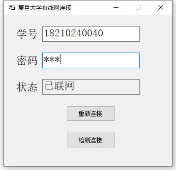

# 复旦大学有线网连接工具
一款使用C#制作的复旦大学有线网自动连接工具，大小不到200K，非常轻量级的小工具。
在后台运行，检测到断线会自动重连。
## 下载
https://github.com/mulin-xml/FudanConnection/releases
## 使用说明
只有一个可执行文件，打开后输入学号和密码点击连接即可。
点击右上角关闭会自动缩小到托盘，程序退出请在托盘处右键点击退出。
## 界面

